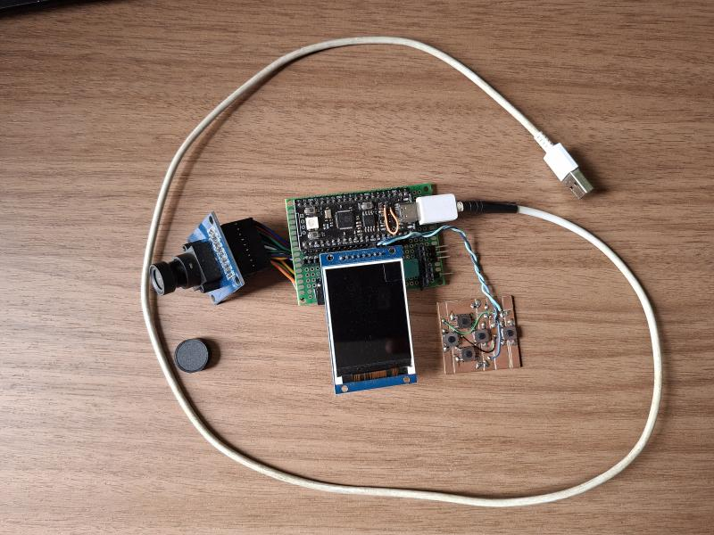
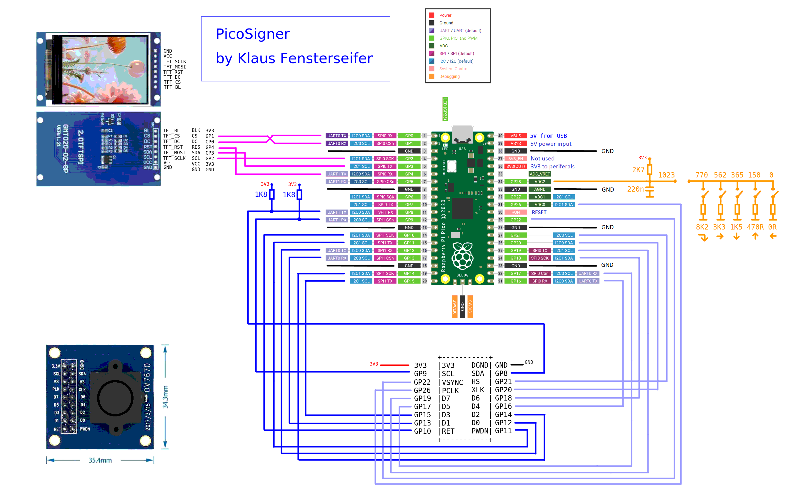
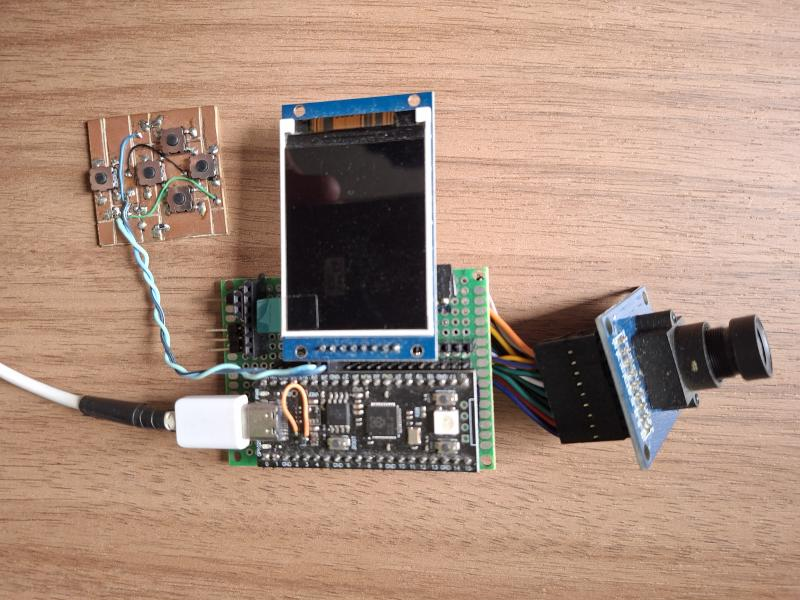
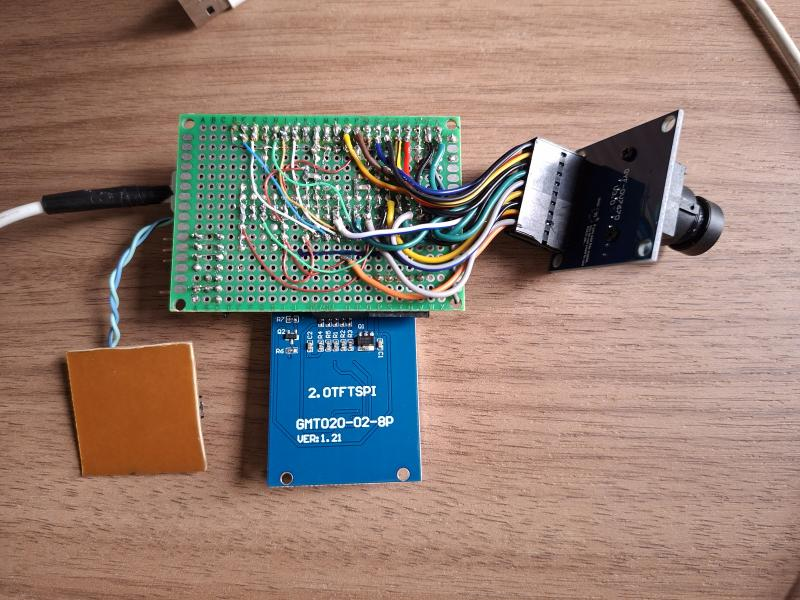
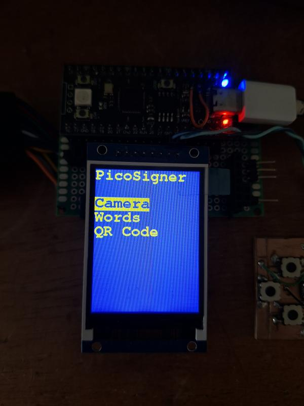
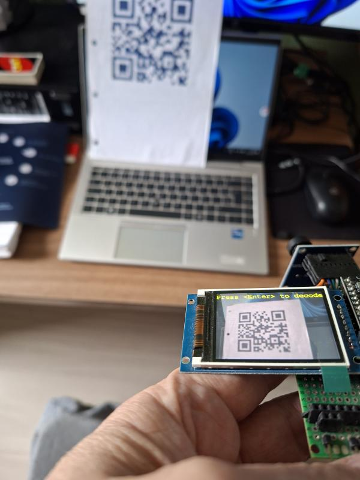
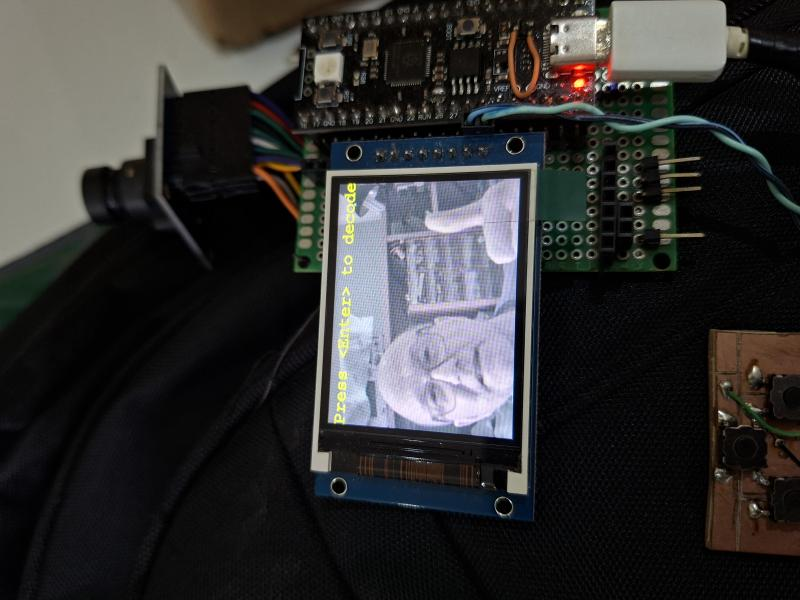
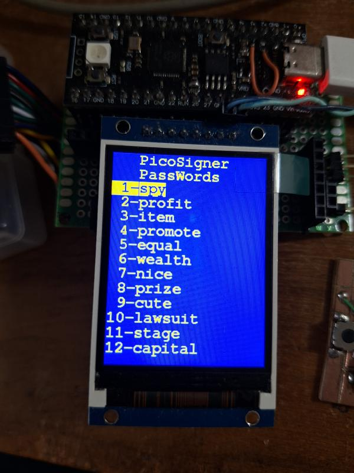
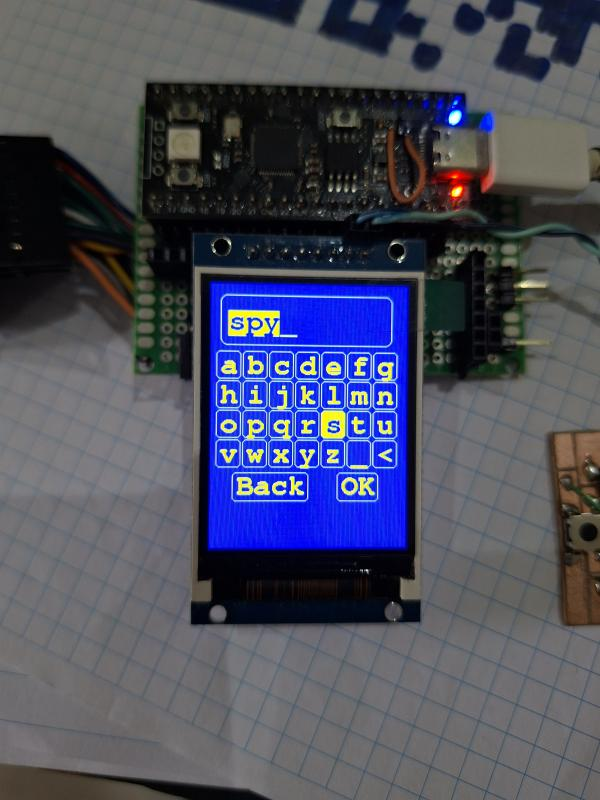
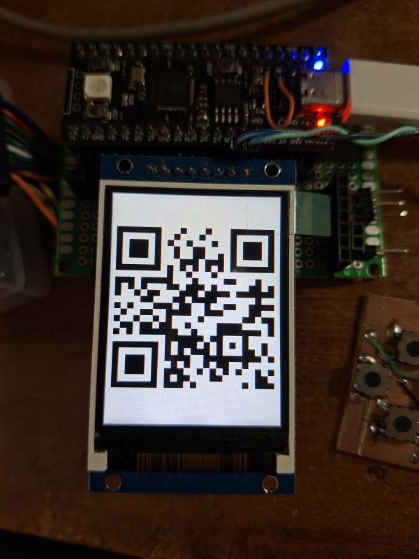

# RPI_PicoSigner
# Airgapped Bitcoin transaction signing device
# Using RPI Pico RP2040, OV7670 and ST7789
# ** Not finished **
## by Klaus Fensterseifer - PY2KLA

 
 
This project is an attempt to create a Bitcoin transaction signing device similar to SeedSigner (https://github.com/SeedSigner/seedsigner), but using a Raspberry Pi Pico without access to Wi-Fi, Bluetooth, or any other means of communication besides a wired USB connection. 

It uses an RPI Pico, an OV7670 camera, and an ST7789 display, all low-cost components. 

The idea is to create a project similar to SeedSigner, but simpler. 
 

The main challenge of this project is using the limited memory available on the RPI Pico to capture image data from the camera for QR code scanning. In addition, implementing the Bitcoin cryptographic functions and the user interface also requires considerable effort. 
 

## I confess...

I confess that I was more interested in seeing whether I could make the camera work with the RPI Pico using PIO, learn more about RGB color formats and scanning QR codes, than in completing the entire project. 

Looking at it this way, I achieved my goal: the hardware interface part is done, and now I just need to finish the application layer using the available data. 
 

At this point, the project is already capable of reading data from the camera, scanning QR codes, and interacting with the user through switches and the display. 
 

## PicoSigner schematic

## PicoSigner top (ugly assembly)

## PicoSigner botton (ugly assembly)

## Software
It uses the Arduino IDE to compile.
 - Board: Arduino Raspberry Pi Pico/RP2040/RP2350 by  Earle F. Philhower, III / Raspberry Pi Pico 
 
Arduino Libraries used: 
 - Crypto by Rhys Weatherley
 - QRCode by Richard Moore
 - TFT_eSPI by Bodmer

Warning must be ignored (display without touch): 
#warning >>>>------>> TOUCH_CS pin not defined, TFT_eSPI touch functions will not be available! 
 

## Main menu for test

## It can read QR code with the wallet words
As debug, It sends the QR code read through serial. 
 

## Camera quality
Camera example with faint colors, but good to read the QR code. 
 

## It can input the wallet words through keyboard

## It can input the wallet words typing the letters

## It can generate QR code signing result

 

## Have fun
As it stands, the project can already serve as a reference or as a foundation for someone who wants to improve it. 

It still requires additional code before it can be useful for complete Bitcoin transaction signing. 

